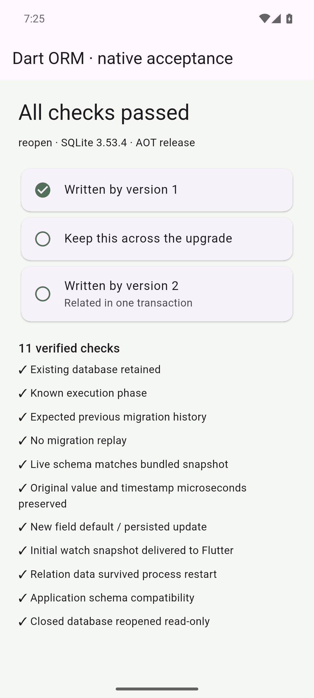

# Native Flutter

[`example/flutter`](../example/flutter/README.md) is an actual Android application
using generated ORM APIs and `SqliteOptions.file` in the app's private files
directory. SQLite runs in the native driver's worker isolate. The small Android
method channel supplies the directory, launch phase, API level and process ID;
all database operations and migration checks run in Dart through the public ORM.

The current example statically imports fixed Dart migrations and their recorded
fingerprints. Migration JSON assets and runtime asset loading have been removed.
The capture described below precedes this change until the new APK acceptance run
is recorded.

The [captured report](../research/validation/flutter.json) records Flutter 3.47.4
stable, Dart 3.13.3 and SQLite 3.53.4 on an Android API 35 arm64 emulator. It includes
the exact framework/engine revisions, APK hashes, source hashes and device build.

| Installed application | Checks | Verified behavior |
| --- | --- | --- |
| Version code 1, debug APK | 4 | Empty database, initial migration, generated transactional inserts, close and read-only reopen |
| Version code 2, release AOT APK, `adb install -r` | 17 | Existing file/history, only the pending migration, live catalog, original values/microseconds, new default, generated relations, committed watch refresh, rollback without persistence/notification, typed patch, worker progress, native cancellation and reuse, application version and read-only reopen |
| Same version 2 APK after force-stop/relaunch | 11 | New process, retained database/rows/relations/history, no migration replay, initial watch, compatibility and read-only reopen |

These are 32 assertions across three phases, not 32 independent platform scenarios.
The host independently checks installed APK version codes, distinct live process
IDs, an unchanged database path and identical final rows/history after restart.
The old physical `body` column remains in place when Dart exposes it as `text`.
The upgrade adds a defaulted `done` column and a comments table without dropping
or rebuilding the existing notes table.

During the final captured release run, summing a recursive sequence of two million
integers took 253,845 microseconds. The main isolate's 16 ms timer advanced 15
times and its Flutter animation listener advanced 7 times during that awaited SQL
operation. The report's `flutterFrames` field counts those animation frame
callbacks; it is not a raster timing or delivered-FPS measurement. This establishes
that database work does not occupy the UI isolate for the entire query. It does
not establish a frame-rate target or physical-device performance.

Build and run commands are in the [example instructions](../example/flutter/README.md).
`tool/test_flutter.dart` requires a dedicated emulator and refuses an already
installed acceptance application. Both APKs use the example's debug signing key
to permit a real upgrade with retained data. Reports travel through bounded log
chunks; Android's Flutter log sink truncated larger chunks during development,
so the application uses 700-character payloads. The host rejects incomplete or
conflicting chunks and waits for the activity transition before its screenshot.

This verifies Android arm64 on the recorded emulator. Physical devices, iOS and
macOS Flutter need their own acceptance runs. Process force-stop/relaunch does not
simulate sudden power loss. Watch refreshes cover writes made through the same
database instance; external writes still need [explicit invalidation](watch.md).
The 834 native SQLite/PostgreSQL checks and 19 scenarios in each Chrome JS/WASM
run are separate evidence. This stage changed no ORM runtime source.
